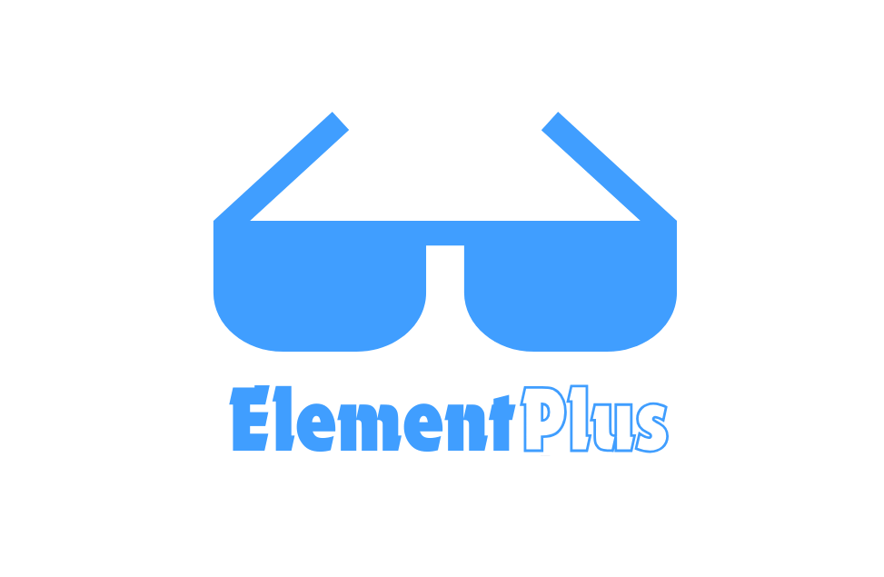

	

<h2 align="center">Awesome Element Plus</h2>

  A curated list of awesome things related to <a href='https://github.com/element-plus/element-plus'>Element Plus</a>
    
  
    

**Legend**: 💙 Official · 👓 Live demo · 🌐 Website

- [Resources](#resources)
  - [Official Resources](#official-resources)
  - [Element UI For Vue2](#element-ui-for-vue2)
  - [Community](#community)
  - [Tutorials](#tutorials)
  - [Blog Posts](#blog-posts)
- [Recommended With](#recommended-with)
- [Components & Libraries](#components--libraries)
- [Apps/Websites](#appswebsites)
- [Templates](#templates)
  - [Admin Template](#admin-template)
  - [Starter Template](#starter-template)

## Resources

### Official Resources

- [Documentation](https://element-plus.org)
- [GitHub Repo](https://github.com/element-plus/element-plus)
- [Release Notes](https://github.com/element-plus/element-plus/releases)

### Official Project

- 💙 [Playground](https://github.com/element-plus/element-plus-playground) - Element Plus [Play](https://element-plus.run/)
- 💙 [Icons](https://github.com/element-plus/element-plus-icons) - Element Plus icons collection.
- 💙 [element-plus-nuxt](https://github.com/element-plus/element-plus-nuxt) - Element Plus module for Nuxt.
- 💙 [unplugin-element-plus](https://github.com/element-plus/unplugin-element-plus) - On-demand import style for Element Plus.

### Element UI For Vue2

- [Documentation](https://element.eleme.io)
- [GitHub Repo](https://github.com/ElemeFE/element)

#### Awesome Element UI

[vue2]: https://img.shields.io/badge/-Vue%202-42b883

This option only adds exceptional items, and in principle does not add special content.

- [vue-element-admin](https://github.com/PanJiaChen/vue-element-admin) - 🎉 A magical vue admin. [👓](https://panjiachen.github.io/vue-element-admin/#/login?redirect=%2Fdashboard) ![vue2]
- [vue-admin-better](https://github.com/zxwk1998/vue-admin-better) - 🎉 vue admin. [👓](https://vue-admin-beautiful.com/shop-vite) ![vue2]

### Community

- [SegmentFault](https://segmentfault.com/t/element-plus)
- [Discord](https://discord.com/invite/gXK9XNzW3X)
- [Docs Translation](https://crowdin.com/project/element-plus)
- [Components Core Locale Translation](https://github.com/element-plus/element-plus/tree/dev/packages/locale/lang)

### Tutorials

- [Vue 3 Migration Guide](https://v3-migration.vuejs.org/)
- [Element 2.x to Element Plus Break Change](https://github.com/element-plus/element-plus/discussions/5658)

### Blog Posts

- [Element Plus 源码分析——构建与代码风格](https://juejin.cn/post/7076941611216666654)

## Recommended With

Using these libraries together will double your efficiency in using Element Plus.

- [Vite](https://github.com/vitejs/vite) - Next generation frontend tooling. It's fast! [🌐](https://vitejs.dev/)
- [Typescript](https://github.com/microsoft/TypeScript) - The most popular front-end language on github, a first-class citizen in Vscode. [🌐](https://www.typescriptlang.org/)
- [pnpm](https://github.com/pnpm/pnpm) - Fast, disk space efficient package manager. [🌐](https://pnpm.io/)
- [Tailwind CSS](https://github.com/tailwindlabs/tailwindcss) - A utility-first CSS framework. [🌐](https://tailwindcss.com/) - [Play](https://play.tailwindcss.com/)
- [unocss](https://github.com/unocss/unocss) - The instant on-demand atomic CSS engine. [🌐](https://unocss.dev/) - [Play](https://unocss.dev/play/)
- [scss](https://github.com/sass/dart-sass) - The reference implementation of Sass, written in Dart. [🌐](https://sass-lang.com/dart-sass/)
- [vueuse](https://github.com/vueuse/vueuse) - Collection of essential Vue Composition Utilities. [🌐](https://vueuse.org/) - [中文](https://vueuse.pages.dev/)
- [unplugin-vue-macros](https://github.com/vue-macros/vue-macros) - Extend more macros and syntax sugar to Vue. [🌐](https://vue-macros.dev/)
- [unplugin-auto-import](https://github.com/unplugin/unplugin-auto-import) - Auto import APIs on-demand.
- [unplugin-vue-components](https://github.com/unplugin/unplugin-vue-components) - 📲 On-demand components auto importing for Vue.
- [vite-plugin-vue-inspector](https://github.com/webfansplz/vite-plugin-vue-inspector) - Click DOM open IDE.
- [Vue DevTools Next](https://github.com/vuejs/devtools-next) - The next iteration of Vue DevTools.
- [Volar](https://github.com/vuejs/language-tools) - Vue IDE syntax hints. - [Download](https://marketplace.visualstudio.com/items?itemName=Vue.volar)

## Components & Libraries

- [element-pro-components](https://github.com/tolking/element-pro-components) - A component library for Vue 3 base on Element Plus. [🌐](https://tolking.github.io/element-pro-components/zh-CN/guide/)
- [el-table-infinite-scroll](https://github.com/yujinpan/el-table-infinite-scroll) - Infinite scroll for el-table. [🌐](https://yujinpan.github.io/el-table-infinite-scroll/)
- [el-select-v2](https://github.com/kooriookami/el-select-v2) - 不论你的数据量多大，虚拟列表都能毫无压力地处理. [👓](https://kooriookami.github.io/el-select-v2/)

## Apps/Websites

- [Vuetelescope Filter](https://www.vuetelescope.com/explore?ui.slug=element-ui&framework_null=true&_sort=lastDetectedAt:desc)

## Templates

### Admin Template

- [vue-pure-admin](https://github.com/pure-admin/vue-pure-admin) - 🔥 全面 `ESM`+`Vue3`+`Vite`+`Element Plus`+`TypeScript` 编写的一款后台管理系统（兼容移动端）. [👓](https://pure-admin.github.io/vue-pure-admin)
- [vue-manage-system](https://github.com/lin-xin/vue-manage-system) - `Vue3`、`Element Plus`、`typescript` 后台管理系统. [👓](https://lin-xin.github.io/example/vue-manage-system)
- [Geeker-Admin](https://github.com/HalseySpicy/Geeker-Admin) - ✨ 基于 `Vue3.4`、`TypeScript`、`Element Plus` 开源的一套后台管理框架. [👓](https://admin.spicyboy.cn)
- [RuoYi-Vue3](https://github.com/yangzongzhuan/RuoYi-Vue3) - 🎉 (RuoYi) 基于 `SpringBoot`，`Spring Security`，`JWT`，`Vue3 & Vite`、`Element Plus` 的前后端分离权限管理系统
- [Vue.NetCore](https://github.com/cq-panda/Vue.NetCore) - `.NetCore`、`.Net6`、`TypeScript`、`Element Plus`+`uniapp` 前后端分离. [👓](http://www.volcore.xyz)
- [geekai](https://github.com/yangjian102621/geekai) - AI 助手, 采用 `Go` + `Vue3` + `Element Plus` 实现. [👓](https://ai.r9it.com/)

### Starter Template

- 💙 [Vite Starter](https://github.com/element-plus/element-plus-vite-starter) - A starter kit for Element Plus with Vite. [👓](https://vite-starter.element-plus.org)
- 💙 [Nuxt 3 Starter](https://github.com/element-plus/element-plus-nuxt-starter) - A starter example for Element Plus with Nuxt 3. [👓](https://element-plus-nuxt.vercel.app)
- [Vitesse Lite](https://github.com/antfu-collective/vitesse-lite) - ⛺️ Although Element Plus is not installed by default, it is still highly recommended. [👓](https://vitesse-lite.netlify.app/)
- [v3-admin-vite](https://github.com/un-pany/v3-admin-vite) - ☀️ A vue3 admin template. [👓](https://un-pany.github.io/v3-admin-vite)
